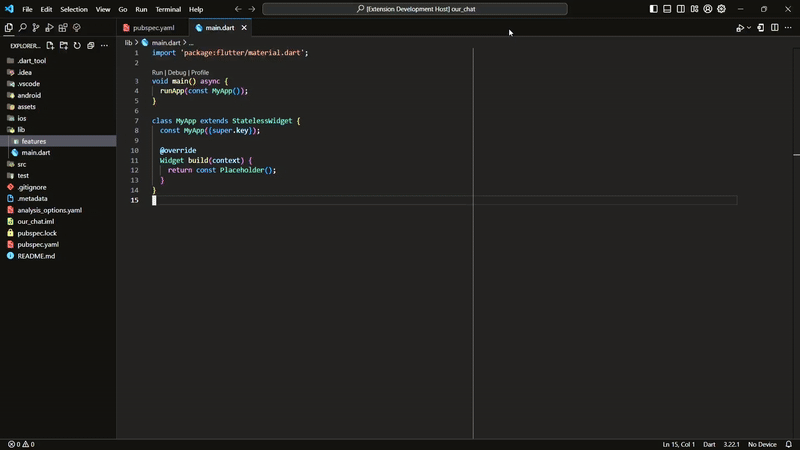

# Flutter Clean Architecture Extension

This VS Code extension allows Flutter developers to quickly scaffold a feature-driven clean architecture structure in their projects. The extension creates folders and files based on the Clean Architecture pattern, helping to maintain a modular and scalable codebase.

#### Preview



## Features

- Prompts for a feature name.
- Creates a folder structure adhering to feature-driven Clean Architecture.
- Available as a right-click context menu option for Dart/Flutter projects.
- Generates `data`, `domain`, and `presentation` layers for the feature.

## Folder Structure

When you right-click on a folder and select the option to generate the clean architecture structure, the following directories will be created inside the folder you right-clicked on:

```
project_structure/
├── data/
│   ├── datasource/
│   ├── model/
│   └── repository/
|
├── domain/
│   ├── entities/
│   ├── repository/
│   └── usecases/
|
├── presentation/
│   ├── screens/
│   ├── state/
│   └── widgets/
```

## Usage

1. Right-click on a folder within a Dart/Flutter project in the VS Code Explorer.
2. Select the `Create Feature` option from the context menu.
3. Input the name of the feature (e.g., "auth").
4. The extension will create the folder structure for that feature under the folder you selected.

## Installation

You can install this extension from the VS Code marketplace or by downloading it manually and placing it in the extensions folder.

## Known Issues

- The extension doesn't currently support file templates (only folder creation).

## Release Notes

### 0.0.1

Initial release of Flutter Clean Architecture extension.

---
