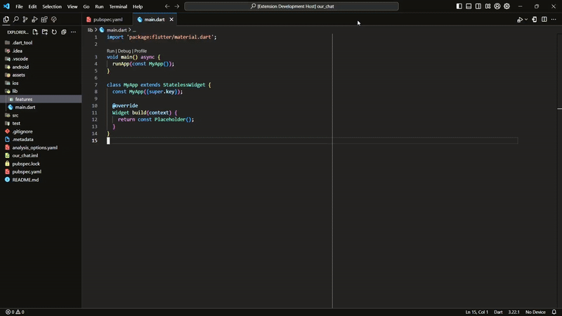

# VS Code Extension Quickstart



## What's in the Folder

- `./src/extension.js`: The entry point for the extension. This file contains the activation logic for creating a feature-driven clean architecture folder structure in Dart/Flutter projects.
- `package.json`: Contains the extension manifest. It defines the command and the conditions under which the extension can be activated.

## Get Up and Running

1. **Install dependencies**: If your extension has any dependencies, install them by running `npm install` or `yarn` in the root directory.
2. **Run the extension**:

   - Press `F5` to open a new VS Code window where you can run and test your extension.
   - Right-click on a folder in a Dart/Flutter project and use the "Create Clean Architecture Folders" option.

3. **Make changes**:

   - You can make modifications to `extension.js` and add additional functionality, such as generating template files or enhancing the folder structure.
   - The changes can be tested in the new VS Code window by restarting the extension (`F5`).

4. **Debugging**:
   - Use the built-in debugger to step through your code and troubleshoot any issues.
   - You can add breakpoints in `extension.js` to inspect the code as it runs.

## Packaging the Extension

Once you're ready to distribute your extension, you can package it using VS Code's CLI tools:

```bash
vsce package
```
